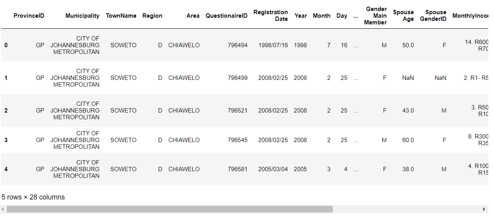
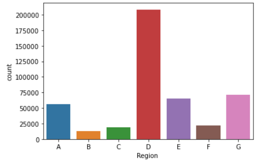
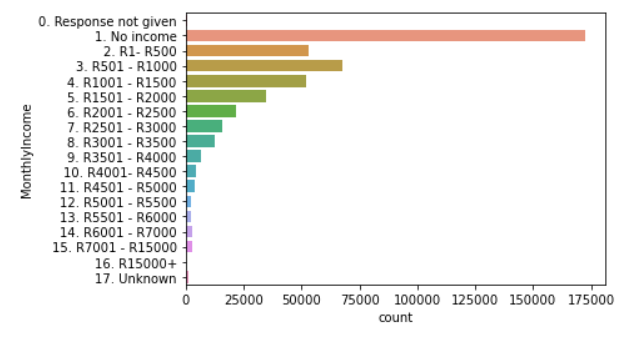
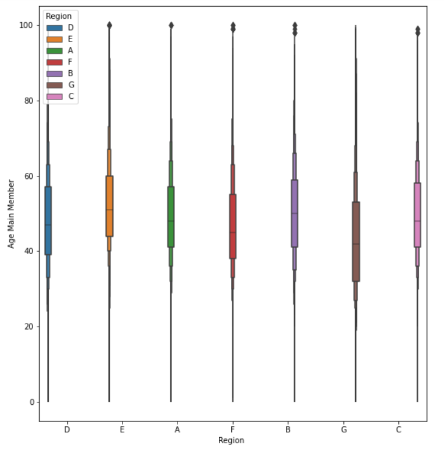
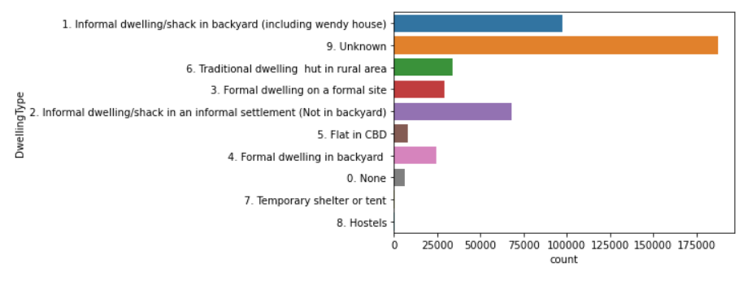

Millions of people move to Johannesburg every year in search of opportunities, yet the housing market is not able to keep up with demand.
The government's Department of Human Settlements fund housing programmes in all municpalities such as Johannesburg in order to provide housing to citizens.
This project explores the housing applicant data for citizens in the City of Johannesburg which stood at approximately 450,000 applicants in 2018.

<div class="text-center p-4">
  
</div>

This page is split into two sections and covers 5 insights I extracted from the dataset and also 5 things I did to clean the dataset and improve data quality.

# Insights
I explored the data graphically using the Seaborn data visualisation library.

### 1. I looked at the number of housing applications made from 1994 to 2018.
- Apart from the initial spike when the housing program was launched, the top 3 years for housing applications were in 2008 (72,755 applications) followed by 2017 (47,642 applications) and 2000 (32,408 applications). 
- The average number of applications over this period was 17,622.
<div class="text-center p-4">
  
</div>

### 2. Next I wanted to know how many housing applicants are there in each region of Johannesburg?
```cpp
sns.countplot(x=newdf['Region '], order=['A','B','C','D','E','F','G'])
```
<div class="text-center p-4">
  
</div>

- Region D has the most applicants which is expected as this were Soweto is located which has become one most highly populated areas in Johannesburg. Soweto alone is home to 1.2 million people of Johannesburg's 5.6 million population.

<div class="text-center p-4">
  
</div>


### 3. Next I looked at how many applicants there were in various monthly income brackets:
<div class="text-center p-4">
  
</div>

### 4. Next I looked at the age distrubuition of applicants split by gender.
<div class="text-center p-4">
  
</div>

### 5. Finally I looked at what Dwelling types applicants are staying in at the moment. 
- Most applicants for public housing are those living in informal dwelling types and likely have poor access to water, energy and sanitation services.
<div class="text-center p-4">
  
</div>

# Data Cleaning
Below is a breakdown of how I explored and cleaned the public housing applicant dataset.

Here is a summary of rows which have data in each column and as we can see several columns have data gaps where no values were entered:

```cpp
newdf.count()


ProvinceID            455791
Municipality          455791
TownName              455791
Region                455791
Area                  455791
QuestionaireID        455791
Registration Date     455791
Year                  455791
Month                 455791
Day                   455791
StreetName            454786
HouseNo               455498
WardNo                 25097
HomeTelNo             216429
WorkTelNo               1843
CellNo                290476
Relationship          455791
Age Main Member       455388
Gender Main Member    455786
Spouse Age             36302
Spouse GenderID        36305
MonthlyIncome         455717
HSS Status            455791
DwellingType          455788
EnergySource          455788
Sanitation            455788
Water                 455788
Disability             73683
dtype: int64
```
## 1. Removing duplicate data
- I identified duplicate entries based on the QuestionaireID field since each unique applicant should have a unique Questionnaire and only one entry in the applicant dataset. 
- My analysis found over 14,000 duplicates in the dataset which were removed and reduced the number of unique applicants to 441,553.
- The variable 'p' stores a boolean value which evaluates if a Questionaire ID is a duplicate or not.
- The variable 'q' is a list that stores all the Questionaire ID values that evaluated to True and 14,238 duplicates were identified.

```cpp
p = newdf.duplicated('QuestionaireID')

q = []
for i in p.iteritems():
    if i[1] == True:
        q.append(i[0])
        
len(q) = 14238

newdf.drop_duplicates(subset='QuestionaireID', keep='first',inplace=True)
```

## 2. Removing superfluous columns:
- Province and Municipality are the same for the whole dataset --> "Gauteng" and "Johannesburg"
- Work telephone number, spouse age and spouse gender was provided by very few applicants and will not be useful for analysis of the main applicant.

```cpp
newdf = newdf.drop(columns=['ProvinceID','Municipality','WorkTelNo','Spouse Age', 'Spouse GenderID'])
```

These are the columns that are now left in the dataframe:

```cpp
newdf.columns

Index(['TownName', 'Region ', 'Area', 'QuestionaireID', 'Registration Date',
       'Year ', 'Month ', 'Day', 'StreetName', 'HouseNo', 'WardNo',
       'HomeTelNo', 'CellNo', 'Relationship', 'Age Main Member',
       'Gender Main Member', 'MonthlyIncome', 'HSS Status', 'DwellingType',
       'EnergySource', 'Sanitation', 'Water', 'Disability'],
      dtype='object')
```

## 3. Next up is filling the gaps or empty rows:

```cpp
newdf['StreetName'] = newdf['StreetName'].fillna('None')
newdf['HouseNo'] = newdf['HouseNo'].fillna('None')
newdf['WardNo'] = newdf['WardNo'].fillna(0)
newdf['HomeTelNo'] = newdf['HomeTelNo'].fillna('None')
newdf['CellNo'] = newdf['CellNo'].fillna('None')
newdf['Age Main Member'] = newdf['Age Main Member'].fillna(0)
newdf['Gender Main Member'] = newdf['Gender Main Member'].fillna('U')
newdf['MonthlyIncome'] = newdf['MonthlyIncome'].fillna('0. Response not given')
newdf['DwellingType'] = newdf['DwellingType'].fillna('9. Unknown')
newdf['EnergySource'] = newdf['EnergySource'].fillna('9. Unknown')
newdf['Sanitation'] = newdf['Sanitation'].fillna('10. Unknown')
newdf['Water'] = newdf['Water'].fillna('12. Unknown')
```

## 4. Investigation of Ward number values:
- As shown by output below, I found that the Ward number column is filled with poorly formatted data, inconsistent data types and string values, where only integers are expected. The quality of the data would not good enough to use in analysis so I removed this column with a plan to rebuild it later.

```cpp
newdf['WardNo'].unique()

array([0, '11', '2', '12', '121', '32', '23', '22', '21', '10', '1002',
       '2003', '100', '200', '65', '95', '920', '632', '0', '62', '16',
       '119', '25', '66', '29', '19', ' ', 'BLOCK 8', '47', '53', '48',
       '63', '321', '500', '153', '85', '42', '43', '103', '1661', '654',
       '129', '44', '45', '7', '50', 'none', '84', '49', '82', '52', '9',
       12.0, 14.0, 24.0, 35.0, 32.0, 200.0, 100.0, 20.0, 65.0, 95.0, 50.0,
       119.0, 53.0, 952.0, 129.0, 51.0, 61.0, 54.0, 31.0, 29.0, 30.0,
       10.0, 15.0, 125.0, 123.0, 120.0, 21.0, 34.0, 28.0, 632.0, 652.0,
       321.0, 62.0, 654.0, 39.0, 2003.0, 1002.0, 27.0, 621.0, 962.0,
       332.0, 19.0, 26.0, 25.0, 122.0, 112.0, 236.0, 3176.0, 23.0, 2001.0,
       52.0, 130.0, 110.0, '26', '33', '300', '231', '35', '621', '36',
       '951', '37', '34', '652', '54', '6', '24', '46', '51', '1', '17',
       '13', '55', '18', 'Q', '2127', '259', '41', '38', '39', '322',
       '2000', '20', '98', '962', '130', '14', '40', '102', '8', '230',
       '123', '1230', '522', '620', '191', 'NONE', '31', '120', '852',
       '3', '202', '125', '563', '630', '5', '4', '56', '921', '15', '27',
       '28', '30', '106', '227', '92', '             ', '362', 'WARD 25',
       'REGION 9', 'MAPETLA', '952', '2001', '3003', '39/41', 'WARD 39',
       '213', '963', '263', '210', 'ward 15', '122', 'EXT 29', '542',
       '49FARANA', '127', '113', 'ward 12', '1003', '193', '320', '520',
       '57', 'NUL', 'CHRIS HANI', '149', '201', '114', 'REGION  D', '651',
       '400', ' N/A', '258', 'PIMVILLE EXT6', 'kh', '4061A', '203', '115',
       '135', 'NU', 'ZONE 6', '128', 'DIEPKLOOF ZONE 4', '199',
       'PROTEA NORTH', 'PIMVILLE ZONE 4', '67', 'non', 'WARD 75',
       '         ', '107', '91', '90', '600', '521', '159', 'E', '75',
       'no 15 avenue', '3002', 'REGION A', ']', 'REGION6', 'A', '352',
       '156', '1159', '145', '221', '911', '960', '96', '116', '154',
       '152', '69', '650', '124', '77', '60', '2111', '403', '68', '118',
       '279', ' CAMP', '58', '965', 'van der merwe', '178', '1830', '126',
       '627', '1811', 'fre', '24  FREEDOM PARK', 'AVENUE', '1376', '3597',
       'STR', '59', 'WARD 62', '61', '1259', '86', 'WARD 60', 'NO', '610',
       '73', 'WARD 21', '74', '2100', '79', '105', '196', '80', 'T',
       'UNKOWN', '97', '1122', '89', '64', 'BLOCK A', 'unknoww',
       'THABEDE', '110', 'GRASMERE', 'MOUNTAIN VIEW', 'G', 'unknown',
       '832', 'PLOT 56', 'WARD 10', '241', '358', '829', '693', 'ext 9',
       22.0, 1.0, 57.0, 89.0, 6.0, 7.0, 79.0, 111.0, 77.0, '2103', '192',
       '78', 'mlilo', '08 REGION A', '111', '214', '177', 'RGION  4',
       '131', 'EXT 3B', '2013', '1000', 'ward 3', '953', '99', '491',
       'EXT2', '71', '70', '72', '925', '624', '914', '220', '81', '83'],
      dtype=object)
```


## 5. Next I did an investigation of the applicant Age values by printing out the summary statstics for the column:

```cpp
newdf['Age Main Member'].describe()
count    441553.000000
mean         48.312248
std          13.670387
min           0.000000
25%          39.000000
50%          47.000000
75%          57.000000
max        1814.000000
Name: Age Main Member, dtype: float64
```
- As shown in the output above the highest age entered is 1814 and lowest age is 0 indicating some data entry errors as these ages are unrealistic age values for an applicant and would skew the data.
- In order to remove these outliers, I removed rows from the dataset where the age value was under 18 or over 100. This resulted in the removal of 648 rows.

```cpp
newdf.drop(newdf[newdf['Age Main Member']>100].index, inplace=True)
newdf.drop(newdf[newdf['Age Main Member']<18].index, inplace=True)

newdf['Age Main Member'].describe()
count    440905.000000
mean         48.323522
std          13.204649
min          18.000000
25%          39.000000
50%          47.000000
75%          57.000000
max         100.000000
Name: Age Main Member, dtype: float64
```
- Interestingly, there still appear to be some applicants where the age value is 100. This may be plausible but would require further investigation to ensure this is not a data error.
