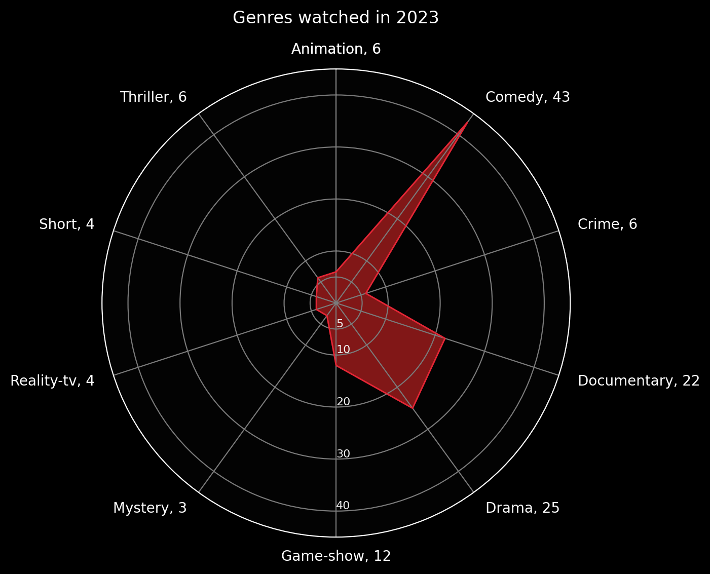
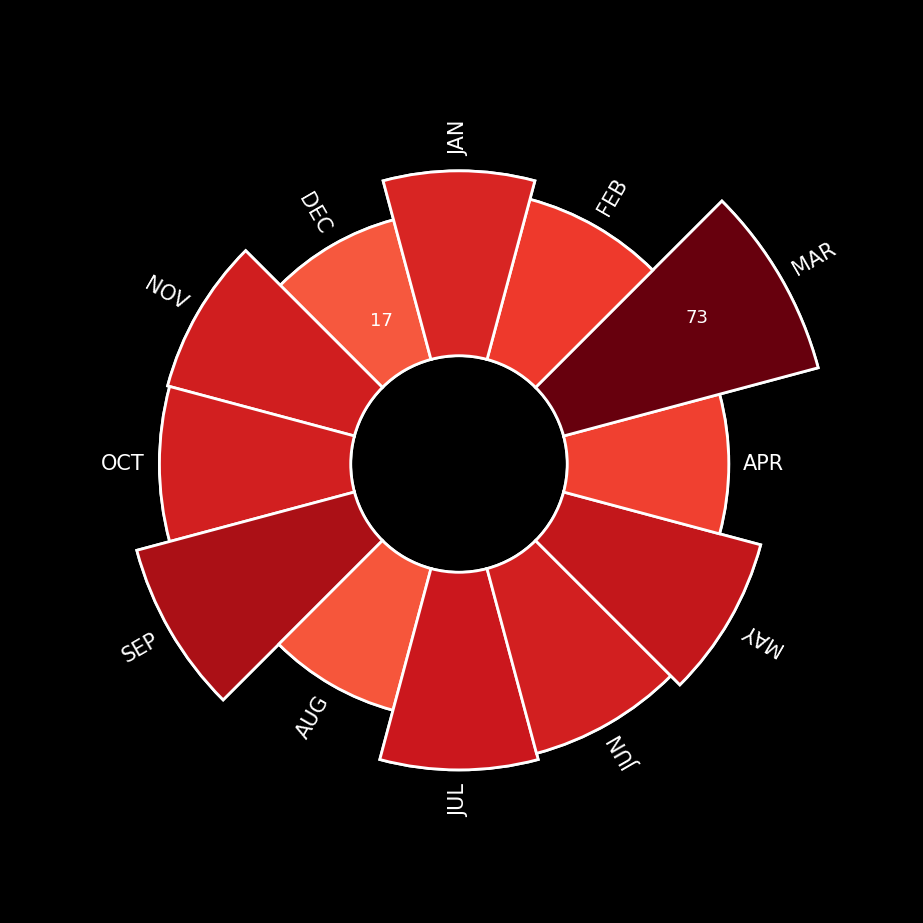
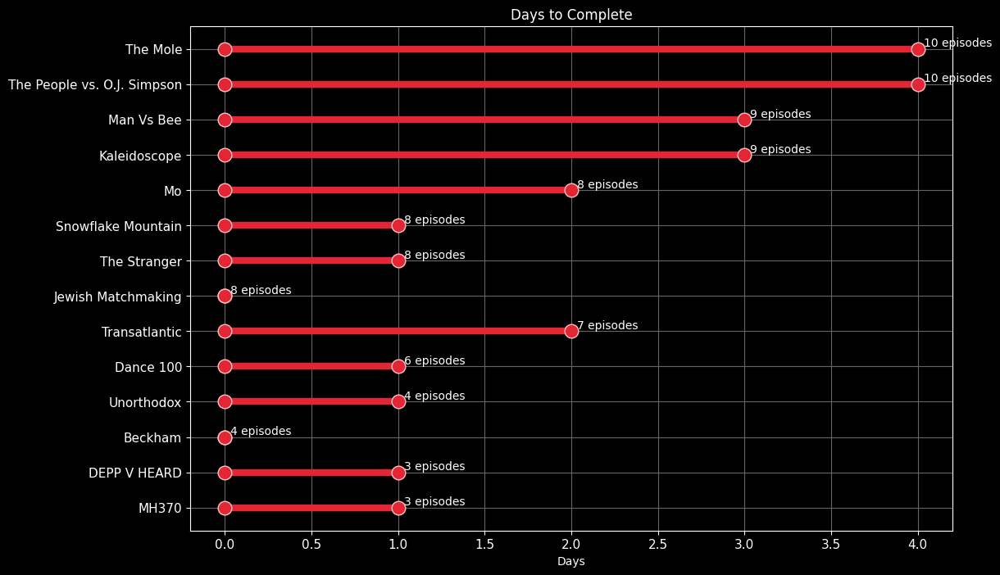

If you are unfamiliar with [Spotify Wrapped](https://en.wikipedia.org/wiki/Spotify_Wrapped) it's an end-of-year review of listening habits on the platform. Despite having a wealth of data, Netflix does not give users any personalised insights into their watching habits so I decided to take on the project for myself and call it Netflix Wrapped.

Netflix Wrapped was written using Python and Matplotlib. Within a week I was able to download my usage data, clean the data and create 5 data visualisations. Through this project, I gained experience with creating:
* radial graphs
* dumbbell graphs
* radar graphs
* maps

Below I'll take you through what I did to prepare the data and what findings emerged. See my Netflix Wrapped essay for an extended discussion on what transpired during this project.

### **Genres watched 🌈**

Here I pulled the 27 genre categories used on the IMDB and categorised every title on my list into a primary genre and secondary genre where necessary. One title represents a unique TV show or Movie title. <\b> My top 5 favourite genres were Comedy, Documentary, Drama, Game-shows, with Thrillers, Crime, and Animation tied for fifth place.

### **Binge-watching 🍿** 

|  |**Key Stats** 
  + In 2023 I watched 450 unique titles.
  + 67 of these were once-off shows or movies and 383 were episodes in a series.
  + Fastest watch time: 8 episodes in 1 day 🏁 |

It’s well-known that many video streaming platforms like Netflix and YouTube are built to keep you watching so you could say binge-watching is a key marker of success for these platforms. And let’s just say the house always wins.
 
Binge-watching peaked in March for me, when I watched 3 different game shows from start to finish. In September my viewing peaked again with 55 titles watched, which coincided with the much-anticipated drop of the final season of _Sex Education_. When I looked deeper into why I watched 20 episodes of _Sex Education_ in September it was clear that after watching the 8 episodes of the final season I had a period of withdrawal about the show being over and proceeded to watch 12 more episodes from previous seasons. In my essay, I further discuss the pros and cons of the binge-watching strategy employed by Netflix. 
  
**Places I went with Netflix Airlines**  

I have always considered my taste in entertainment to be very diverse and global but I wondered if the data would match up. I think TV and movies are great ways to explore new perspectives and places with relative ease. For this visualization I categorized my viewing history based on the language and/or filming location of each title. Here I wanted to see what titles I watched that originated outside of Hollywood and the USA. I have managed to watch several South African (also known as Mzansi), Brazilian, and Kenyan titles but most bizarrely 2023 had been the year of Australian content for me and I watched 6 titles from down under. "                                                                                   

