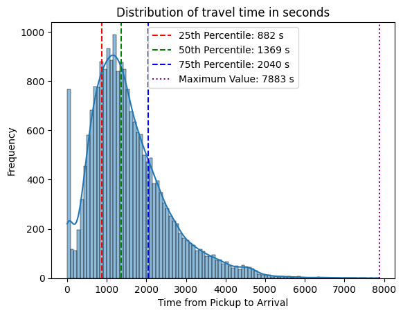

### Overview

I developed a machine learning regression model to predict delivery arrival times for Sendy, a logistics company operating in Nairobi, Kenya. The project analysed over 28,000 completed deliveries, using 21,201 observations for model training and 7,068 observations for testing. The objective was to minimise prediction error by optimising the model's Root Mean Squared Error (RMSE), with delivery time measured in seconds.

This project demonstrates the application of statistical analysis, feature engineering, data preprocessing, predictive modelling, and model evaluation to solve a real-world logistics optimisation problem.

### Dataset Exploration

The dataset contained 25 variables describing delivery characteristics, including:

- Delivery distance
- Pickup and confirmation timestamps
- Geographic coordinates
- Weather conditions
- Vehicle type
- Customer type
- Rider information

An initial exploratory assessment was undertaken to identify variables most likely to influence delivery time while balancing model simplicity and predictive performance.

### Feature Selection and Engineering

I chose three predictor variables based on their statistically significant impact on the delivery time:

<table>
  <thead>
    <tr>
      <th>Feature</th>
      <th>Rationale</th>
    </tr>
  </thead>
  <tbody>
    <tr>
      <td><strong>Distance (km)</strong></td>
      <td>Longer travel distances generally increase delivery time.</td>
    </tr>
    <tr>
      <td><strong>Day of Week</strong></td>
      <td>Weekday and weekend traffic patterns differ significantly, influencing travel times.</td>
    </tr>
    <tr>
      <td><strong>Precipitation</strong></td>
      <td>Rainfall contributes to congestion and slower travel speeds.</td>
    </tr>
  </tbody>
</table>
<br>

Several preprocessing and feature engineering steps were performed:

- Converted categorical weekday values into a binary weekday/weekend indicator.
- Imputed missing precipitation values assuming no recorded rainfall.
- Transformed precipitation into a binary rain/no-rain feature.
- Standardised predictor variables before model training to ensure all features were on a comparable scale, improving the stability and efficiency of the model.

These transformations simplified the feature space while retaining variables with meaningful predictive value (code snippet below).

```cpp
#weekdays get a dummy value of 0
train1['Pickup_-_Weekday_(Mo_=_1)'] = train1['Pickup_-_Weekday_(Mo_=_1)'].replace([1,2,3,4,5],0)

#weekend days get a dummy value of 1
train1['Pickup_-_Weekday_(Mo_=_1)'] = train1['Pickup_-_Weekday_(Mo_=_1)'].replace([6,7],1)

#no rain day get dummy 0
train1['Precipitation_in_millimeters'] = train1['Precipitation_in_millimeters'].fillna(int(0))

#rain days get dummy 1 else 0
train1['Precipitation_in_millimeters'] = np.where(train1['Precipitation_in_millimeters'] > 0, 1, 0)

```

### Machine Learning Model

A regression pipeline was developed using Scikit-learn, combining:

- StandardScaler for feature normalisation
- Stochastic Gradient Descent (SGD) Regressor for predictive modelling

The model was trained to estimate delivery time using engineered predictor variables.

### Model Evaluation

Model performance was evaluated using Root Mean Squared Error (RMSE), a standard regression metric that measures the average amount of prediction error.

_Model Performance_

- Training observations: 21,201
- Test observations: 7,068
- RMSE: ≈ 794 seconds (13.2 minutes)

The model successfully generated delivery time predictions for unseen deliveries, demonstrating the complete supervised learning workflow. 

### Reflection

On average, the model's predicted delivery times differ from the actual delivery times by about 794 seconds (13.2 minutes). 
<br>
<table>
  <thead>
    <tr>
      <th>Statistic</th>
      <th>Value</th>
    </tr>
  </thead>
  <tbody>
    <tr>
      <td>Mean travel time</td>
      <td><strong>1,557 s (26.0 min)</strong></td>
    </tr>
    <tr>
      <td>Median travel time</td>
      <td><strong>1,369 s (22.8 min)</strong></td>
    </tr>
    <tr>
      <td>Standard deviation</td>
      <td><strong>987 s (16.5 min)</strong></td>
    </tr>
    <tr>
      <td>RMSE</td>
      <td><strong>794 s (13.2 min)</strong></td>
    </tr>
  </tbody>
</table>
<br>

| Statistic          | Value                  |
| ------------------ | ---------------------: |
| Mean travel time   | **1,557 s (26.0 min)** |
| Median travel time | **1,369 s (22.8 min)** |
| Standard deviation | **987 s (16.5 min)**   |
| RMSE               | **794 s (13.2 min)**   |

 

The typical delivery time in the dataset was 1,557 seconds (26 minutes), with the middle 50% of deliveries ranging from 882 seconds (14 minutes) to 2,040 seconds (34 minutes). With an RMSE of 794 s (13 minutes)this level of accuracy suggests the model could support high-level operational planning, such as estimating driver workload, like the estimated time needed for a delivery. However, the prediction error remains too large for precise customer-facing ETAs.

While the model captures general patterns in delivery time, the relatively high RMSE suggests that delivery duration is influenced by additional variables beyond the three predictors used, such as traffic conditions, time of day or location-based factors. A quick correlation test shows that the longitude coordinates of the start and end locations influence travel time, implying that deliveries moving east or west across the city may take longer.

Future model iterations could also compare alternative regression algorithms such as Linear Regression, Random Forest, Gradient Boosting, or XGBoost, together with hyperparameter tuning and cross-validation to improve predictive accuracy.


### Key Statistical and Machine Learning Skills Demonstrated
- Exploratory data analysis (EDA)
- Feature selection based on domain knowledge
- Feature engineering and data preprocessing
- Missing value treatment
- Binary encoding of categorical variables
- Data standardisation
- Supervised machine learning (regression)
- Model training using stochastic gradient descent
- Predictive model evaluation using RMSE
- Python, Pandas, NumPy and Scikit-learn
